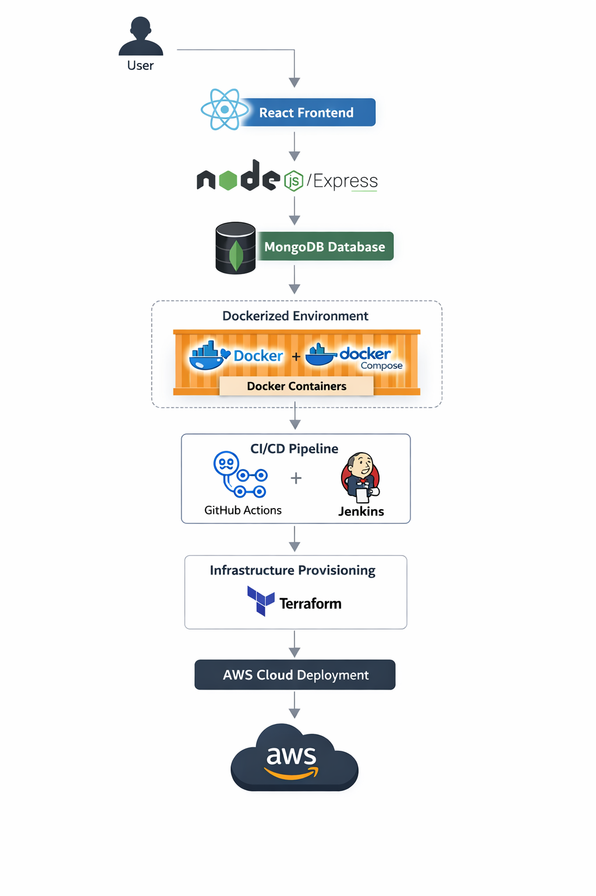

# 🧘‍♀️ Health & Wellness Dashboard – DevOps Deployment

## 📌 Overview
This project demonstrates the deployment of a **Health & Wellness Dashboard web application** using modern DevOps practices. The application is built using the MERN stack and focuses on **containerization, automation, and scalable cloud deployment**.

---

## 🚀 Features
- Dockerized MERN stack application
- Multi-container setup using Docker Compose
- CI/CD pipeline automation (GitHub Actions & Jenkins)
- Infrastructure as Code (IaC) using Terraform
- Cloud deployment using AWS CLI
- Scalable and reproducible environments

---

## 🏗️ Architecture



---

## ⚙️ Tech Stack

**Frontend:** React.js  
**Backend:** Node.js, Express.js  
**Database:** MongoDB  

**DevOps & Cloud:**  
- Docker, Docker Compose  
- Terraform  
- AWS CLI  
- GitHub Actions, Jenkins  
- Linux (WSL)  

---

## 📂 Project Structure
/client → React frontend
/server → Node.js backend
/docker → Docker configuration files
/terraform → Infrastructure as Code files
/.github → CI/CD workflows

---

## 🔄 CI/CD Workflow

1. Code pushed to GitHub  
2. CI pipeline builds and tests application  
3. Docker images are created  
4. Terraform provisions infrastructure  
5. Application is deployed to AWS  

---

## 📦 Setup Instructions

### 1. Clone the repository
```bash
git clone https://github.com/your-username/your-repo-name.git
cd your-repo-name
docker-compose up --build
cd terraform
terraform init
terraform apply
📈 Future Improvements

Add monitoring (Prometheus & Grafana)

Implement Kubernetes orchestration

Improve security with IAM roles & secrets management

👩‍💻 Author

Budhathri Bandara


